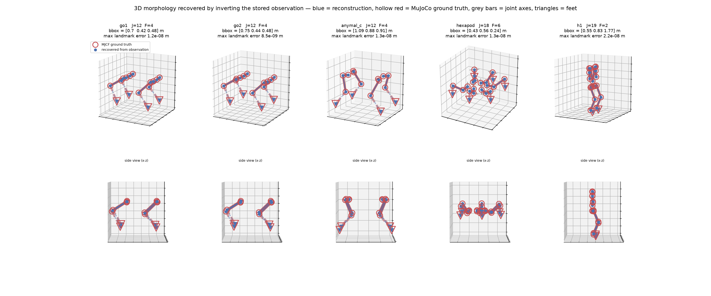

# Dataset

> [!note] Draft
> 이 문서는 `all_robots_replay_forward_1m` dataset의 현재 이해를 정리한 초안이다. Dataset 구성과 측정값은 제공된 reference를 기준으로 작성했으며, 실제 파일과 preprocessing code를 이 repository에 연결한 뒤 다시 검증해야 한다.

## 1. Dataset Overview

| 항목 | 내용 |
|---|---|
| Dataset | `all_robots_replay_forward_1m` |
| Source | HuggingFace [`haruki-abe/cross_embodiment_offline_rl`](https://huggingface.co/datasets/haruki-abe/cross_embodiment_offline_rl), subset `offline_data/all_robots_replay_forward_1m` |
| Related work | *Cross-Embodiment Offline Reinforcement Learning for Heterogeneous Robot Datasets* [@abe2026cross] |
| Environment | [`one_policy_to_run_them_all`](https://github.com/nico-bohlinger/one_policy_to_run_them_all) [@bohlinger2025urma] |
| Simulator | MuJoCo, `timestep=0.005` |
| Task | Flat-terrain locomotion under a velocity command |
| Robots | 16 |
| Transitions | robot별 1,000,000개, 전체 16,000,000개 |
| Episode horizon | 최대 1,000 control steps, 약 20초 |
| Raw size | 약 82 GB |
| Processed size | 약 5.42 GB |

이 dataset은 expert demonstration이 아니라 multi-robot vectorized environment에서 수집한 **replay buffer**다. 16개 robot이 같은 timestep에 병렬로 실행되었으며, behavior quality는 transition과 robot에 따라 달라진다.

`forward`는 command distribution을 의미한다. 전체 dataset에서 `goal_y=0`, `goal_yaw=0`이므로 모든 robot은 전진 locomotion만 수행한다.

현재 repository에는 dataset이나 preprocessing script가 포함되어 있지 않다. Reference에 기록된 경로는 다음과 같으며, 실제 연결 위치는 추후 확정한다.

- Raw: `dataset/offline_data/all_robots_replay_forward_1m/`
- Processed: `processed/robots/`
- Preprocessing report: `processed/PREPROCESSING_REPORT.md`
- Loader: `scripts/clrl_loader.py`

## 2. Raw Data Format

Raw dataset은 다음 일곱 개 `.npy` array와 metadata로 구성된다.

```text
observations.npy       (1000000, 16, 668)  float32
next_observations.npy  (1000000, 16, 668)  float32
actions.npy            (1000000, 16,  24)  float32
rewards.npy            (1000000, 16)       float32
dones.npy              (1000000, 16)       bool
terminateds.npy        (1000000, 16,   1)  float32
truncateds.npy         (1000000, 16,   1)  float32
metadata.json          {"n_samples": 1000000, "n_envs": 16}
```

- `axis 0`: vectorized environment의 공통 step index
- `axis 1`: 고정된 environment slot
- `axis 2`: observation 또는 action feature

### 2.1 Axis 1: Environment Slot

여기서 environment는 하나의 robot과 그 robot의 MuJoCo state를 포함하는 독립적인 simulator instance를 뜻한다. Data collection에서는 16개의 environment를 병렬로 실행했고, 각 environment slot에 서로 다른 robot type 하나를 고정적으로 배정했다.

따라서 이 dataset에서는 `axis 1`이 사실상 robot identity와 일대일로 대응한다.

```text
observations[t, 0, :]   = vectorized step t에서 unitree_a1의 observation
observations[t, 1, :]   = vectorized step t에서 unitree_go1의 observation
...
observations[t, 15, :]  = vectorized step t에서 hexapod의 observation
```

즉 shape의 `16`은 16종의 robot이 각각 하나의 environment slot에 들어 있기 때문에 생긴다. 일반적인 vectorized environment에서 slot은 반드시 robot type을 뜻하지 않지만, 이 dataset의 수집 configuration에서는 `slot index = robot index`다.

각 slot은 episode가 끝나면 같은 robot으로 reset된 뒤 stream을 이어간다. 따라서 `axis 1`은 episode index가 아니며, slot `e`를 선택하면 robot `e`의 1,000,000-step chronological stream을 얻는다. Robot transition이 서로 섞여 있지 않으므로 별도의 de-interleaving은 필요하지 않다.

Robot마다 joint와 foot 수가 다르기 때문에 observation은 최대 `668`, action은 최대 `24`까지 뒤쪽이 `0.0`으로 padding되어 있다. Reference에서는 전체 16,000,000 transition에 대해 padding이 정확히 `0.0`임을 확인했다.

보고된 전체 값 범위는 다음과 같다.

| Array | Range |
|---|---:|
| `observations` | `[-85.54, 126.82]` |
| `actions` | `[-7.02, 7.64]` |
| `rewards` | `[0.0, 0.1224]` |

NaN과 Inf는 발견되지 않았다.

## 3. Robot Roster

Environment slot 순서는 upstream `multi_robot/default_config.py::train_robot_types`를 따른다. `robot_helper.py`의 `ROBOTS` 순서와 혼동하면 안 된다.

| env | robot | joints | feet | native obs | native act | obs padding | act padding |
|---:|---|---:|---:|---:|---:|---:|---:|
| 0 | `unitree_a1` | 12 | 4 | 380 | 12 | 288 | 12 |
| 1 | `unitree_go1` | 12 | 4 | 380 | 12 | 288 | 12 |
| 2 | `unitree_go2` | 12 | 4 | 380 | 12 | 288 | 12 |
| 3 | `anymal_b` | 12 | 4 | 380 | 12 | 288 | 12 |
| 4 | `anymal_c` | 12 | 4 | 380 | 12 | 288 | 12 |
| 5 | `barkour_v0` | 12 | 4 | 380 | 12 | 288 | 12 |
| 6 | `barkour_vb` | 12 | 4 | 380 | 12 | 288 | 12 |
| 7 | `badger` | 13 | 4 | 406 | 13 | 262 | 11 |
| 8 | `bittle` | 8 | 4 | 276 | 8 | 392 | 16 |
| 9 | `unitree_h1` | 19 | 2 | 538 | 19 | 130 | 5 |
| 10 | `unitree_g1` | 23 | 2 | 642 | 23 | 26 | 1 |
| 11 | `talos` | 24 | 2 | 668 | 24 | 0 | 0 |
| 12 | `robotis_op3` | 20 | 2 | 564 | 20 | 104 | 4 |
| 13 | `nao_v5` | 22 | 2 | 616 | 22 | 52 | 2 |
| 14 | `cassie` | 10 | 2 | 304 | 10 | 364 | 14 |
| 15 | `hexapod` | 18 | 6 | 560 | 18 | 108 | 6 |

`talos`가 가장 넓은 observation/action interface를 가지며 padding width `668/24`를 결정한다.

## 4. Observation Layout

Robot의 native observation dimension은 다음 식을 따른다.

```text
native_obs_dim = 26 * number_of_joints + 12 * number_of_feet + 20
```

전체 observation layout은 다음과 같다.

```text
[ joint block 0 ] ... [ joint block J-1 ]   26 dims each
[ foot block 0  ] ... [ foot block F-1  ]   12 dims each
[ general dynamic state ]                   13 dims
[ robot context ]                            7 dims
[ zero padding ]                             to 668
```

### 4.1 Joint Block

각 joint block은 descriptor 23차원과 dynamic state 3차원으로 구성된다.

| dims | content |
|---|---|
| 0–2 | relative joint position in the trunk frame, normalized |
| 3–5 | relative joint axis |
| 6 | number of direct child joints |
| 7 | nominal joint position |
| 8 | torque limit |
| 9 | joint velocity limit |
| 10 | damping |
| 11 | armature |
| 12 | stiffness |
| 13 | friction loss |
| 14–15 | joint range |
| 16–18 | P gain, D gain, action scaling factor |
| 19 | robot mass |
| 20–22 | robot length, width, height |
| 23 | joint position |
| 24 | joint velocity |
| 25 | previous action |

### 4.2 Foot Block

각 foot block은 descriptor 10차원과 dynamic state 2차원으로 구성된다.

| dims | content |
|---|---|
| 0–2 | relative foot position |
| 3–5 | P gain, D gain, action scaling factor |
| 6 | robot mass |
| 7–9 | robot length, width, height |
| 10 | ground contact |
| 11 | time since last ground contact |

### 4.3 Global State and Robot Context

`general dynamic state` 13차원은 다음 값으로 구성된다.

- trunk linear velocity: 3
- trunk angular velocity: 3
- goal velocity: 3
- projected gravity: 3
- height: 1

`robot context` 7차원은 P gain, D gain, action scaling factor, mass, length, width, height다. 같은 7개 값이 모든 joint descriptor와 foot descriptor의 마지막 부분에도 반복되므로 observation에는 의도적인 redundancy가 있다.

### 4.4 3D Reconstruction 범위

**실제 observation에 저장된 morphology descriptor와 topology 정보가 있으면 robot의 static 3D morphology skeleton을 복원할 수 있다.** Joint descriptor `0–2`와 foot descriptor `0–2`의 trunk-frame relative position을 원래 physical scale로 되돌리고, `topology.npz::parent_idx`를 이용해 landmark를 연결하면 된다.

아래 그림은 stored observation에서 복원한 landmark와 MuJoCo model의 ground-truth landmark를 비교한 예시다. 파란 점과 선은 observation에서 복원한 morphology, 속이 빈 빨간 표식은 MuJoCo ground truth, 회색 막대는 joint axis, 삼각형은 foot을 나타낸다. 이 예시에서는 `go1`, `go2`, `anymal_c`, `hexapod`, `h1`의 static skeleton이 ground truth와 거의 정확히 일치한다.



다만 **문서에 적힌 observation layout만으로 즉시 복원할 수 있다는 뜻은 아니다.** 실제 coordinate 값, descriptor scaling의 역변환과 parent-child connectivity가 함께 필요하다.

실제 observation row가 있으면 다음 수준의 표현은 가능하다.

| 사용 정보 | 가능한 표현 |
|---|---|
| 실제 morphology descriptor의 joint/foot position | trunk frame 기준 3D landmark point cloud |
| 위 좌표의 scale 역변환 + `topology.npz::parent_idx` | static 3D morphology skeleton |
| MJCF model + dynamic joint position + forward kinematics | 현재 articulated pose와 link geometry |

Flattened raw observation만 사용할 경우에는 각 joint의 direct child 수만 알 수 있고 어느 joint가 child인지는 알 수 없다. 따라서 landmark 위치는 복원할 수 있지만 올바른 edge를 연결하려면 별도의 topology가 필요하다. 또한 descriptor coordinate는 normalized value이므로 meter 단위로 복원하려면 upstream scaling 정의를 역으로 적용해야 한다.

현재 repository에는 raw/processed array, `topology.npz`와 MJCF model이 포함되어 있지 않으므로 이 repository만으로 reconstruction code를 다시 실행하거나 다른 sample을 복원할 수는 없다. Dataset과 morphology metadata를 연결하면 위 그림처럼 static skeleton을 생성할 수 있다. 현재 자세까지 포함한 articulated reconstruction이나 link mesh rendering은 별도로 MJCF model과 forward kinematics가 필요하다.

## 5. Applied Observation Scaling

Observation은 저장 전에 이미 다음 scaling이 적용된 상태다.

```text
joint position          / 4.6
joint velocity          / 35
previous action         / 10
ground contact          / 0.5 - 1
time since contact      / 2.5 - 1, clipped to [-1, 1]
trunk linear velocity   / 10, clipped to [-1, 1]
trunk angular velocity  / 50, clipped to [-1, 1]
height                  / robot_height - 1, clipped to [-1, 1]
```

추가 normalization은 원본 dataset에 적용된 처리가 아니며, 특히 per-robot z-normalization은 descriptor에 남아 있는 robot 사이의 scale 차이를 제거한다.

## 6. Episode Statistics

Episode은 최대 1,000 step이며 fall 또는 특정 body collision이 발생하면 일찍 종료된다.

| robot | episodes | mean len | min | max | terminated % | mean reward | mean return |
|---|---:|---:|---:|---:|---:|---:|---:|
| `unitree_a1` | 1,056 | 947.0 | 60 | 1000 | 15.5 | 0.0201 | 18.99 |
| `unitree_go1` | 1,045 | 956.9 | 86 | 1000 | 11.9 | 0.0241 | 23.03 |
| `unitree_go2` | 1,434 | 697.4 | 11 | 1000 | 47.9 | 0.0131 | 9.12 |
| `anymal_b` | 1,108 | 902.5 | 48 | 1000 | 17.9 | 0.0132 | 11.95 |
| `anymal_c` | 1,304 | 766.9 | 38 | 1000 | 38.8 | 0.0127 | 9.77 |
| `barkour_v0` | 1,077 | 928.5 | 42 | 1000 | 17.1 | 0.0135 | 12.51 |
| `barkour_vb` | 1,035 | 966.2 | 101 | 1000 | 8.2 | 0.0238 | 23.02 |
| `badger` | 1,038 | 963.4 | 62 | 1000 | 9.6 | 0.0130 | 12.54 |
| `bittle` | 1,036 | 965.3 | 42 | 1000 | 5.5 | 0.0360 | 34.70 |
| `unitree_h1` | 3,630 | 275.5 | 19 | 1000 | 79.6 | 0.0291 | 8.02 |
| `unitree_g1` | 3,555 | 281.3 | 19 | 1000 | 79.4 | 0.0278 | 7.82 |
| `talos` | 2,328 | 429.6 | 16 | 1000 | 64.5 | 0.0510 | 21.91 |
| `robotis_op3` | 1,383 | 723.1 | 30 | 1000 | 38.1 | 0.0654 | 47.28 |
| `nao_v5` | 3,700 | 270.3 | 19 | 1000 | 83.9 | 0.0486 | 13.14 |
| `cassie` | 6,693 | 149.4 | 13 | 1000 | 93.7 | 0.0451 | 6.73 |
| `hexapod` | 1,002 | 998.0 | 14 | 1000 | 0.4 | 0.0443 | 44.18 |

### Sampling-Related Properties

- 모든 robot은 transition 기준으로 1,000,000개를 가지지만 episode 길이와 episode 수는 크게 다르다.
- `hexapod`의 termination rate는 `0.4%`인 반면 `cassie`는 `93.7%`다.
- Uniform transition sampling과 uniform episode sampling은 서로 다른 training distribution을 만든다.
- Reward는 per-step 기준으로 작고 robot별 mean return 차이가 약 7배다.
- 원본 및 processed reward에는 robot별 normalization이 적용되지 않았다.

## 7. Observation Corruption and Domain Randomization

Stored observation은 clean simulator state가 아니다. Collection 과정에서 dropout, observation noise, action delay, physics randomization이 적용되었다.

### 7.1 Observation Dropout

각 step에서 joint와 foot별 독립 mask가 적용되고 선택된 dynamic field가 `0.0`으로 대체된다.

적용 field:

- joint position
- joint velocity
- previous action
- foot ground contact
- time since last ground contact

| robots | per-joint dropout chance |
|---|---:|
| `unitree_a1`, `unitree_go1`, `unitree_go2`, `anymal_b`, `anymal_c`, `barkour_v0`, `barkour_vb`, `badger`, `bittle` | `0.05` |
| `unitree_h1`, `unitree_g1`, `talos`, `robotis_op3`, `nao_v5`, `cassie`, `hexapod` | `0.001` |

Dropout mask는 저장되지 않았다. 따라서 해당 dynamic field의 `0.0`은 실제 값과 missing value를 구분할 수 없다. 예를 들어 12-joint quadruped에서는 한 step에 최소 하나의 joint가 dropout될 확률이 약 `46%`다.

### 7.2 Observation Noise

다음 uniform noise가 scaling 전에 추가된다.

| field | quadrupeds | `bittle` / `hexapod` | humanoids + `cassie` |
|---|---:|---:|---:|
| joint position | ±0.01 | ±0.01 | ±0.003 |
| joint velocity | ±1.5 | ±0.5 | ±0.08 |
| trunk angular velocity | ±0.2 | ±0.1 | ±0.02 |
| projected gravity | ±0.05 | ±0.05 | ±0.015 |

`previous_action`과 foot field에는 noise가 없고 dropout만 적용된다.

### 7.3 Action Delay and Previous Action

`DefaultActionDelay`의 `max_nr_delay_steps=1`이다. Domain-randomization sample마다 `mixed_chance`가 결정되며, 활성화된 동안 각 step에는 `action[t]` 또는 `action[t-1]`이 적용된다.

- `actions.npy`: commanded action
- `joint_state[..., 2] * 10`: observation에 기록된 applied previous action

Dropout과 action delay 때문에 `previous_action`은 `actions`로 정확히 재구성할 수 없다. 따라서 processed dataset에서도 별도로 보존해야 한다.

### 7.4 Mid-Episode Physics Randomization

Mass, gain, torque limit, damping, armature, stiffness, friction loss, joint range가 episode 중에도 다시 sampling되며 descriptor vector도 함께 갱신된다. Reference에서는 robot별 1,000,000 step 동안 약 2,700–4,600개의 morphology segment가 관찰되었다.

따라서 morphology descriptor를 robot마다 하나의 고정 vector로 취급하는 것은 dataset의 실제 생성 과정을 단순화한 approximation이다.

## 8. Processed Data Format

Reference의 processed representation은 robot별 directory와 memory-mapped `.npy` array를 사용한다.

```text
processed/
  PREPROCESSING_REPORT.md
  manifest.json
  robot_mapping.json
  robot_defs.json
  inspection.json
  analysis.json
  roundtrip_validation.json
  robots/<robot>/
    metadata.json
    joint_state.npy              [N, J, 3]
    foot_state.npy               [N, F, 2]
    global_dynamic.npy           [N, 13]
    morphology_segments.npz
    actions.npy                  [N, J]
    rewards.npy                  [N]
    terminated.npy               [N] bool
    truncated.npy                [N] bool
    episode_id.npy               [N] int32
    episode_start_idx.npy        [M] int64
    episode_length.npy           [M] int64
    next_state_exception_idx.npy [X] int64
    next_state_exception_obs.npy [X, native_obs_dim]
    topology.npz
```

여기서 모든 robot에 대해 `N=1,000,000`이다.

### 8.1 Morphology Change-Point Encoding

`morphology_segments.npz`는 morphology descriptor가 바뀌는 지점만 저장한다. Segment `k`는 `[segment_start[k], segment_start[k+1])` 범위를 나타낸다. 연속 step의 약 `99.6%`에서 descriptor가 유지되므로 1,000,000개의 vector 대신 약 2,700–4,600개의 segment만 저장한다.

### 8.2 Next-Observation Exception Encoding

대부분의 transition에서 `next_obs[t] == obs[t+1]`이므로 terminal, 마지막 step, 실제 mismatch row만 exception으로 저장한다. Reference에서는 exact equality를 사용하여 bit-exact reconstruction을 검증했다.

### 8.3 Done Reconstruction

전체 transition에서 다음 관계가 검증되어 `dones`는 processed data에 중복 저장하지 않는다.

```text
dones == terminateds | truncateds
```

### 8.4 Kinematic Topology

`topology.npz`는 trunk, joint, foot을 하나의 graph로 표현한다.

```python
topology["node_type"]           # 0 trunk, 1 joint, 2 foot
topology["parent_idx"]          # -1 for root
topology["joint_node_indices"]
topology["foot_node_indices"]
topology["joint_names"]
topology["foot_names"]
```

`parent_idx`는 MJCF kinematic tree를 따른다. Flattened observation 자체에는 adjacency가 없으므로 connectivity가 필요하면 `topology.npz`를 사용해야 한다.
